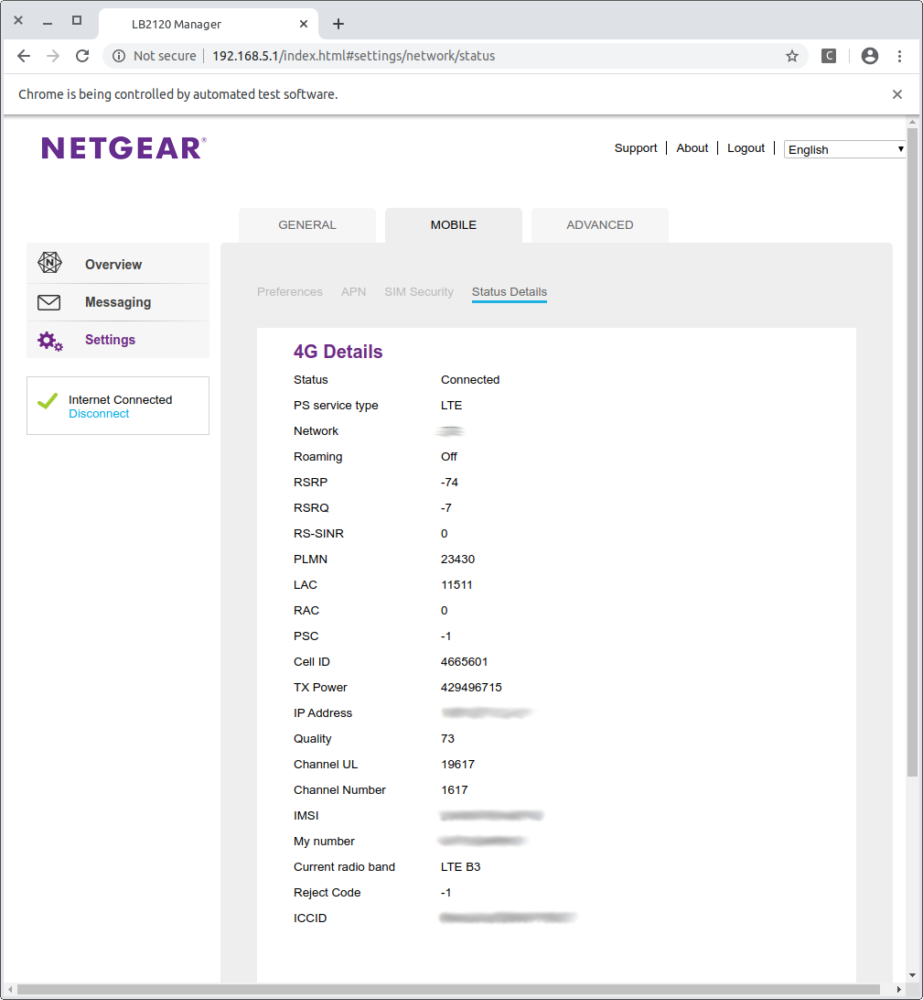
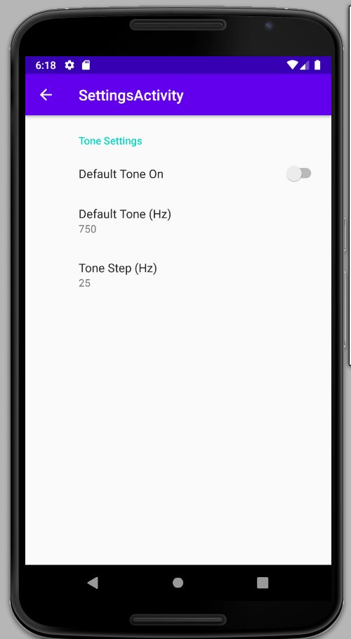
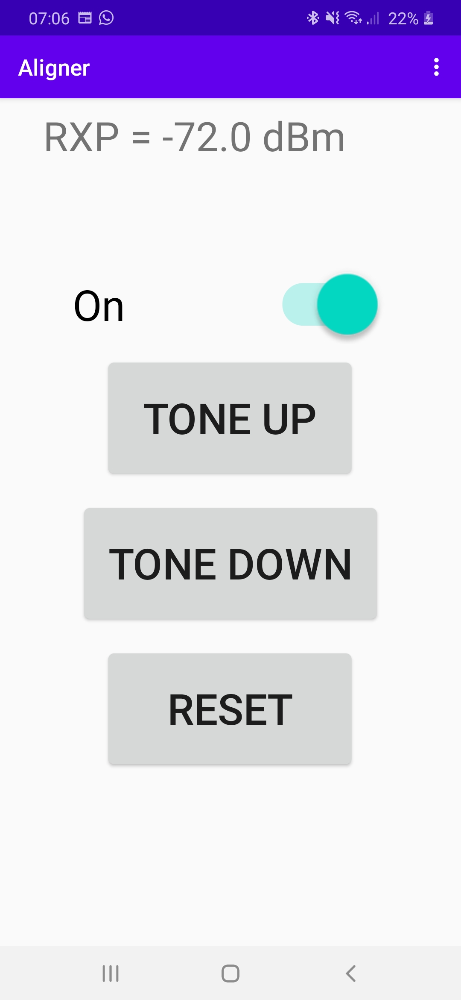
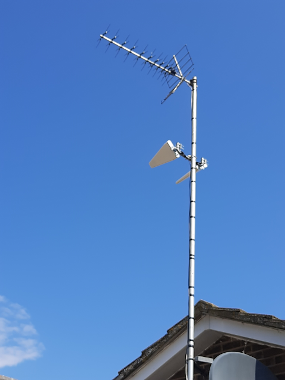

# Netgear LB2120 Aligner

This is a software tool that allows the user to align external antenna's connected
to Netgear LB2120 4G modem devices. I developed this tool when adding a 4G broadband
connection to my house in order to be sure I was getting the maximum receive signal 
level.

# Overview
Aligning the antenna is achieved using a mobile phone or tablet. 
A tone is produced that increases in pitch as the receive power 
of the 4G radio signal from the LB2120 4G modem increases. Thus 
the user may adjust the direction the antenna points for the 
highest tone and the antenna will then be adjusted to receive
the maximum radio signal power.

# Architecture
The software architecture splits the tool into two parts.

1. LB2120
This is a python program that logs into the web interface of the LB2120 
4G modem and reads the receive power signal level. This is held locally 
until the program hears requests from the mobile phone app.

2. Mobile phone App
This is an Android App that the user starts. When started the user can turn 
on a switch (if not enabled by default in the App configuration). This causes 
broadcast to be sent out on the network to obtain the receive power level
of the LB2120 device. When a valid receive power level (in dBm) is received by
the App a tone is generated (default set in the App configuration). This tone
will increase in pitch if the receive power increases.

The user can listen to the tone through headphones connected to a
mobile phone/tablet and have hands free to adjust the 4G antenna in order to
position it to get the maximum receive signal level. This is useful if the 
antenna is not easy to access (E.G on a pole attached to the side of a house).

## Building and Installing the python tools

The pipenv2deb program must be installed in the Linux platform. See 
https://github.com/pjaos/pipenv2deb for details of this. Once this is installed
cd into the lb2120 folder and run the following command to build the debian 
installer package.

```
./build.sh 
INFO:  Set executable attribute: create_pip_env.sh
INFO:  Created build/DEBIAN
INFO:  Created build/usr/local/bin/python-lb2120-tools.pipenvpkg
INFO:  Copied /scratch/git_repos/python3/lb2120/python_tools/open_source_libs to build/usr/local/bin/python-lb2120-tools.pipenvpkg/open_source_libs
INFO:  Copied Pipfile to build/usr/local/bin/python-lb2120-tools.pipenvpkg
INFO:  Copied Pipfile.lock to build/usr/local/bin/python-lb2120-tools.pipenvpkg
INFO:  Set executable attribute: build/usr/local/bin/python-lb2120-tools.pipenvpkg/create_pip_env.sh
INFO:  Copied /scratch/git_repos/python3/lb2120/python_tools/lb2120.py to build/usr/local/bin/python-lb2120-tools.pipenvpkg
INFO:  Copied /scratch/git_repos/python3/lb2120/python_tools/lb2120_mbps.py to build/usr/local/bin/python-lb2120-tools.pipenvpkg
INFO:  Creating build/DEBIAN/postinst
INFO:  Set executable attribute: build/DEBIAN/postinst
INFO:  Set executable attribute: build/DEBIAN/postinst
INFO:  Set executable attribute: build/DEBIAN/prerm
INFO:  Set executable attribute: build/DEBIAN/preinst
INFO:  Set executable attribute: build/DEBIAN/control
INFO:  Created: build/usr/local/bin/lb2120
INFO:  Set executable attribute: build/usr/local/bin/lb2120
INFO:  Created: build/usr/local/bin/lb2120_mbps
INFO:  Set executable attribute: build/usr/local/bin/lb2120_mbps
INFO:  Executing: dpkg-deb -Zgzip -b build packages/python-lb2120-tools-1.1-all.deb
dpkg-deb: building package 'python-lb2120-tools' in 'packages/python-lb2120-tools-1.1-all.deb'.
INFO:  Removed build path
```

## Installing LB2120

This tool is installed onto a Linux computer. The following shows this being
installed from the command line.

```
sudo dpkg -i packages/python-lb2120-tools-1.1-all.deb
(Reading database ... 696946 files and directories currently installed.)
Preparing to unpack .../python-lb2120-tools-1.1-all.deb ...
Removing virtualenv (/home/pja/.local/share/virtualenvs/python-lb2120-tools.pipenvpkg-miwMdHGt)…
Removed python virtual env
Unpacking python-lb2120-tools (1.1) over (1.1) ...
Setting up python-lb2120-tools (1.1) ...
Creating a virtualenv for this project…
Pipfile: /usr/local/bin/python-lb2120-tools.pipenvpkg/Pipfile
Using /usr/local/bin/python3.8 (3.8.2) to create virtualenv…
⠸ Creating virtual environment...created virtual environment CPython3.8.2.final.0-64 in 164ms
  creator CPython3Posix(dest=/home/pja/.local/share/virtualenvs/python-lb2120-tools.pipenvpkg-miwMdHGt, clear=False, global=False)
  seeder FromAppData(download=False, pip=latest, setuptools=latest, wheel=latest, via=copy, app_data_dir=/home/pja/.local/share/virtualenv/seed-app-data/v1.0.1)
  activators BashActivator,CShellActivator,FishActivator,PowerShellActivator,PythonActivator,XonshActivator

✔ Successfully created virtual environment! 
Virtualenv location: /home/pja/.local/share/virtualenvs/python-lb2120-tools.pipenvpkg-miwMdHGt
Installing dependencies from Pipfile.lock (f2005b)…
  🐍   ▉▉▉▉▉▉▉▉▉▉▉▉▉▉▉▉▉▉▉▉▉▉▉▉▉▉▉▉▉▉▉▉ 10/10 — 00:00:03
To activate this project's virtualenv, run pipenv shell.
Alternatively, run a command inside the virtualenv with pipenv run.
**************************************************************
*               Netgear LB2120 Antenna Aligner               *
*   The lb2120 and lb2120_mbps commands are now available    *
**************************************************************
```

## Building and Installing the Android app

- Ensure Android Studio is installed on your PC.
- Open the Android Studio project in the android_app folder.
- Connect an Android mobile phone or tablet to the PC.
- On the phone ensure that developer options and USB debugging are enabled. See [Enabling developer options](https://developer.android.com/studio/debug/dev-options).
- When the phone or tablet prompts you 'Enabled USB debugging' select yes.
- Ensure your Android app or phone is selected next to the Run button in Android Studio.
- Select the Run button in Android Studio and the app will be installed and started on the phone/tablet.
 
# Using the tool
First the lb2120 tool must be started from a Linux machine that has access over the network to the NEtgear LB2120 4G router. This can be done in a terminal window on from the command line as shown below.

```
sudo lb2120
INFO:  Loaded config from /home/pja/.aligner_cap.cfg
INFO:  NETGEAR_LB2120_PASSWORD environmental variable undefined.
INPUT: Enter the password of the Netgear LB2120 4G router: *********
INFO:  Listening on UDP port 18912
```

This will cause a browser window to open as shown below.



After this the Android App (Aligner) should be started on the mobile phone or tablet. The Android app must be connected to a WiFi network that has connectivity to the PC running the lb2120 program detailed above. This will produce a screen as shown below.


Turn the the aligner on if not already on


The phone will produce a tone if it can communicate with the lb2120 app if the lb2120 app has opened a browser window to the Netgear LB2120 device. For hands free operation the tone can be listened to using headphones to make it easier to adjust the antenna position.

The Tone Up/Down buttons can be used to adjust the output tone. The Reset button will reset the tone to the configured default tone.

Selecting the three vertical dots in the top right of the screen will show the configuration screen.



- Default Tone On
If this switch is on when the app is started the Switch will be On.

- Default Tone (Hz)
The frequency of the tone the will be heard when the app first hears connects to the lb2120 program.

- Tone Step (Hz)
This is the frequency change of the tone in Hz that will occur for each 1 dB change in the 4G receive power level. If the RX power increases the tone will go up in frequency and if the 4G receive power level drops the tone will drop in frequency.


When the android app is receiving the 4G receive power level and a tone is produced the 4G receive power is displayed at the top of the window as shown below.



## Antenna
The following is a picture of the 4G antenna (below the TV antenna) that I aligned using this tool.



## Broadband throughput test results
This tool was useful in setting up the antenna for the 4G broadband connection. After alignment I get typical broadband speeds (using www.speedtest.net) of 65 Mbps download and 30 Mbps upload. The best I have seen is 123 Mbps down and 41 Mbps up. The worst I have seen is about 55 Mbps down and 28 Mbps up.


# Netgear LB2120 throughput logging tool
This is a software tool (installed with the lb2120 tool above) that allows the 
user to record the throughput (TX and RX) rates from a Netgear LB2120 router. 
I developed this tool when adding a 4G broadband connection to my house in 
order to record the details of my internet usage.

## Overview
This is a python program that 'scrapes' data from the web interface of a LB2120 
4G modem (TX/RX rates and temperature) and records this data to a mysql database.

## Running the tool

### Configuration
Before using the tool the configuration must be performed as shown below assuming you have a mysql database setup and have manually created the 4G_USAGE database.

```
pja@E5570:~$ lb2120_mbps --config
INFO:  Loaded config from /home/pja/4g_usage_db_config.cfg
INPUT: Enter the address of the MYSQL database server (): 192.168.01.200
INPUT: Enter TCP port to connect to the MYSQL database server (3306): 
INPUT: Do you wish to enter the previous value of 3306 y/n: : y
INPUT: Enter the database username (): yourdbusername
INPUT: Enter the database password (): yourdbpassword
INPUT: Enter the database name to store the data into (): 4G_USAGE
INFO:  Example table schema
INFO:  TIMESTAMP:TIMESTAMP DOWNMBPS:FLOAT(24) UPMBPS:FLOAT(24) TEMPC:FLOAT(24) TEMPCRITICAL:VARCHAR(8)
INPUT: Enter the database table schema (): TIMESTAMP:TIMESTAMP DOWNMBPS:FLOAT(24) UPMBPS:FLOAT(24) TEMPC:FLOAT(24) TEMPCRITICAL:VARCHAR(8)
INFO:  Table schema string OK
INFO:  Saved config to /home/pja/4g_usage_db_config.cfg
```

Now the database is configured you can run the tool to start recording throughput
to the database. The following is an example from a hot summers day (note modem temp).

```
lb2120_mbps 
INFO:  Loaded config from /home/pja/4g_usage_db_config.cfg
INFO:  NETGEAR_LB2120_PASSWORD environmental variable undefined.
INPUT: Enter the password of the Netgear LB2120 4G router: **********
INFO:  Connecting to 192.168.1.200:3306 (database = 4G_USAGE)
INFO:  Connected
INFO:  Connected to database
INFO:  DOWN:          0.781 Mbps
INFO:  UP:            0.090 Mbps
INFO:  TEMP:          61.0 C
INFO:  TEMP CRITICAL: False
INFO:  SAMPLE TIME:   2020-08-12 20:05:50.531065
INFO:  LB2120_STATS TABLE: Added count: 1
INFO:  DOWN:          1.161 Mbps
INFO:  UP:            0.081 Mbps
INFO:  TEMP:          61.0 C
INFO:  TEMP CRITICAL: False
INFO:  SAMPLE TIME:   2020-08-12 20:06:00.931226
INFO:  LB2120_STATS TABLE: Added count: 2
```

This will cause instance of google-chrome to start (which must be installed previously)
The tool will then login to the LB2120 web interface and start retrieving data to save to the database as shown above.

